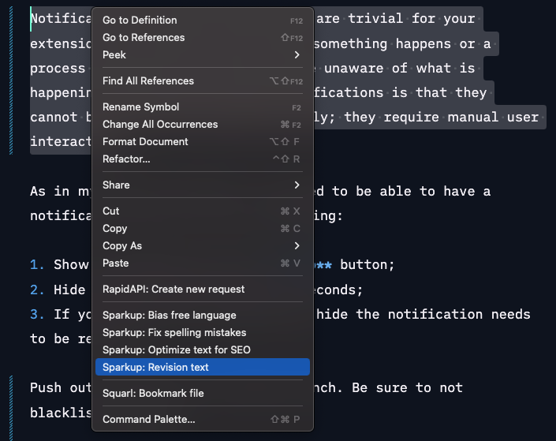

# Sparkup

## Unlock Your Content's Potential with Sparkup

Are you tired of juggling multiple programs just to rewrite your content? Introducing #Sparkup, a VSCode extension that streamlines the editing process by allowing you to rewrite your content directly within the editor. With #Sparkup, you can not only create compelling headlines and titles, but also optimize your content for SEO and revise it with ease. Say goodbye to tedious editing and try #Sparkup in beta today!

### Unleash the Power of AI

With Sparkup, you can elevate your content to new heights by harnessing the power of AI with the following features:

- Targeting your text to a specific audience and purpose
- Ensuring accuracy with spellchecks
- Incorporating inclusive language
- Optimizing for search engine ranking with SEO
- Simplifying your content
- Generating headlines based on the content.

## Tutorial

If you want more information about how to set up Sparkup, you can follow the API tutorial: [Getting started with Sparkup](https://rapidapi.com/eliostruyf/api/sparkup/tutorials/using-the-api-in-combination-with-the-sparkup---visual-studio-code-extension)

## Usage

- Install the extension
- Subscribe yourself to the Sparkup API - [Subscribe to Sparkup API](https://rapidapi.com/eliostruyf/api/sparkup)
- Get your API key and set it in the `sparkup.apiKey` setting.
- Once the API key has been set, you can open your `markdown` file(s), select text, and righ-click to perform Sparkup actions.

  

## Issues / Feedback

All your issues and feedback can be submitted to the [GitHub repository](https://github.com/estruyf/vscode-sparkup/issues).