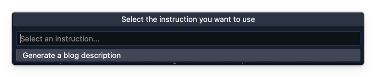

# Sparkup

## Unlock Your Content's Potential with Sparkup

Are you tired of juggling multiple programs just to rewrite your content? Introducing #Sparkup, a VSCode extension that streamlines the editing process by allowing you to rewrite your content directly within the editor. With #Sparkup, you can not only create compelling headlines and titles, but also optimize your content for SEO and revise it with ease. Say goodbye to tedious editing and try #Sparkup in beta today!

### Unleash the Power of AI

With Sparkup, you can elevate your content to new heights by harnessing the power of AI with the following features:

- Revision your text for a specific audience and purpose
- Ensure accuracy with spellchecks
- Use inclusive language (bias-free)
- Optimize for search engine ranking with SEO
- Simplify your content
- Write excerpts for your content
- Automatically generate headlines based on the content
- Categorize and tag your content for better organization
- Provide your own instructions to generate content.

## What data gets passed to Sparkup?

The only information that is shared with our Sparkup API is the text that you have selected to be rewritten. This text is used solely for the purpose of returning the rewritten text to you and is not stored or shared with any third parties. We value your privacy and are committed to keeping your information safe.

## Tutorial

If you want more information about how to set up Sparkup, you can follow the API tutorial: [Getting started with Sparkup](https://rapidapi.com/eliostruyf/api/sparkup/tutorials/using-the-api-in-combination-with-the-sparkup---visual-studio-code-extension)

## Usage

- Install the extension
- Subscribe yourself to the Sparkup API - [Subscribe to Sparkup API](https://rapidapi.com/eliostruyf/api/sparkup)
- Get your API key and set it in the `sparkup.apiKey` setting.
- Once the API key has been set, you can open your `markdown` file(s), select text, and righ-click to perform Sparkup actions.

<p align="center">
  
</p>

## Freeform or custom instructions

The Sparkup API allows for the generation of custom content by providing your own instructions. This feature can be utilized by specifying your instructions in the `sparkup.freeform.instructions` setting in Visual Studio Code. The setting is an array of objects, each with the properties of a title, instruction, and an optional number of results (defaulting to **3** with a maximum of 5) that will be sent to the Sparkup API and used to generate the content. The title will be displayed when selecting the instruction.

The instructions object has the following properties:

- **title**: The title of the instruction. This will be shown when you select the instruction.
- **instruction**: The instruction that will be sent to the Sparkup API and will be used to generate the content.
- **nrOfResults**: The number of results that you want to receive from the Sparkup API. This is optional and defaults to 3 with a maximum of 5.

### Example configuration

```json
"sparkup.freeform.instructions": [
  {
    "title": "Generate a blog description",
    "instruction": "Generate an single paragraph description/excerpt for the following text.\n\nExample 1: In this article, Elio explains how you can create a reusable authentication provider extension that you can leverage in all your extensions.\n\nExample 2: In this article, Elio explains how you can simplify the communication flow from your Visual Studio Code extension and its webview to wait for its response.",
    "nrOfResults": 2
  }
]
```

### Usage

You can make use of your freeform instructions by executing the `Sparkup: Use a freeform instruction` (`vscode-sparkup.freeform`) command. Once you run the command, it will show a list of all your instructions. Select the one you want to use and it will generate the content based on the instruction.

<p align="center">
  
</p>

### Settings

The following settings are available:

| Setting | Description | Default |
| --- | --- | --- |
| `sparkup.apiKey` | The API key that you can get from the [Sparkup API](https://rapidapi.com/eliostruyf/api/sparkup) | `""` |
| `sparkup.freeform.instructions` | The instructions that you want to use for the freeform instructions. | `[]` |
| `sparkup.contextMenu.enabled` | Whether to show the Sparkup context menu (right-click on selected text). | `true` |

## Issues / Feedback

All your issues and feedback can be submitted to the [GitHub repository](https://github.com/estruyf/vscode-sparkup/issues).

<br />
<br />

<p align="center">
  <a href="https://visitorbadge.io" title="Visitor badge service">
    
  </a>
</p>